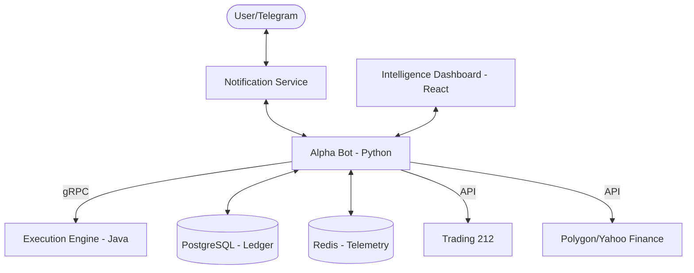

# 🏛️ Architecture: Alpha Arbitrage Elite

This document describes the high-fidelity interaction between the various components of the Alpha Arbitrage system.

## 1. System Overview

The project is structured as a **Multi-Service Containerized Ecosystem** managed by Docker Compose.

## 2. Component Roles

### 🐍 Alpha Bot (Python 3.11)
The "Brain" of the operation.
- **Core Orchestration**: Manages the Kalman Filter engine and the AI Agent Swarm.
- **Portfolio Management**: Tracks allocations, targets, and DCA schedules.
- **SSE Server**: Streams real-time telemetry to the dashboard via FastAPI.

### ☕ Execution Engine (Java)
The "Hands" of the operation.
- **gRPC Server**: Receives high-speed execution requests from the Python bot.
- **Latency Monitoring**: Uses nanosecond interceptors to audit Round-Trip Time (RTT).
- **Hardened Execution**: Implements idempotency keys and shadow-mode fill realism.

### ⚛️ Intelligence Dashboard (React/Vite)
The "Face" of the operation.
- **Adaptive UI**: Displays the `PixelBot` emotional state.
- **Telemetry Loop**: Subscribes to SSE events for real-time Z-Score and Market Regime visualization.
- **Terminal Hub**: Allows direct command execution via a secure authenticated bridge.

## 3. Data Flow & Communication

### Real-Time Telemetry (SSE/WebSocket)
1. **Bot** pushes state updates to **Redis**.
2. **Dashboard Service** (FastAPI) polls metrics or detects events.
3. **EventSource (SSE)** broadcasts updates to the **React Frontend**.
4. **WebSocket** handles low-latency telemetry like nanosecond gRPC RTT spikes.

### Authentication (Basic Auth)
The bot uses a **Key:Secret** pair for Trading 212.
- **Header**: `Authorization: Basic Base64(KEY:SECRET)`
- **Fallback**: Automatically falls back to `/api/v1` endpoints if `/api/v0` returns a 401 Unauthorized error.

## 4. Adaptive Intelligence Logic

The `PixelBot` emotional state is derived from system telemetry:
- **IDLE**: No active signals, market is horizontal.
- **ANALYZING**: AI Agents (Bull/Bear) are currently debating a signal.
- **EXECUTING**: Orders are being sent to the Execution Engine.
- **GLITCH**: L2 Entropy is high or Volatility Switch is triggered (High Danger).
- **DOUBT**: Strategy accuracy is low (< 40%) or Risk Multiplier is heavily capped.

---

## 5. Security & Risk Guards

- **Cluster Guard**: Prevents over-exposure to single sectors (e.g., tech-heavy portfolios).
- **Spread Guard**: Ensures execution only happens when the bid-ask spread is tight (<1.5%).
- **Financial Kill Switch**: Immediately closes positions if a strategy drawdown exceeds 15%.
