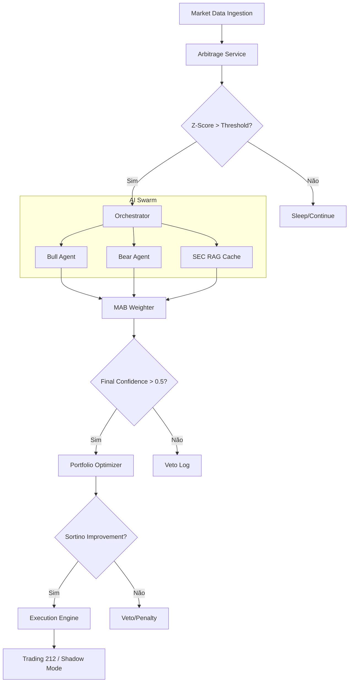

# 🏗️ Arquitetura Técnica: Alpha Arbitrage

O Alpha Arbitrage utiliza uma arquitetura de microatendimento orientada a eventos, desenhada para baixa latência no processamento de sinais e alta resiliência na execução.

## 1. Fluxo de Vida de um Sinal

O diagrama abaixo descreve como um par de ativos é processado desde a ingestão de dados até à execução da ordem.

## 2. Componentes Críticos

### 🧵 Orchestrator (O Cérebro)
Localizado em `src/agents/orchestrator.py`, este componente gere o debate entre agentes. Ele utiliza `asyncio.gather` para disparar análises paralelas, garantindo que a decisão final seja tomada em menos de 2 segundos.

### 🛡️ Risk Service (A Rede de Segurança)
Gere os limites de exposição setorial e o **Financial Kill Switch**. Antes de qualquer ordem ser enviada para o broker, o Risk Service valida se o capital está dentro dos parâmetros de sobrevivência extrema definidos no `.env`.

### 🗄️ Camada de Persistência
- **SQLite**: Utilizado para estados de curta duração e configurações locais (ex: calendários DCA).
- **PostgreSQL**: O livro-razão (Ledger) oficial de trades e performance.
- **Redis**: Ponto de troca de mensagens de alta velocidade, cache para métricas fundamentais da SEC e controlo de idempotência (evitando ordens duplicadas em caso de queda de rede).

## 📡 Comunicação gRPC
Para o motor de execução, utilizamos gRPC com interceptores de nanosegundos. Isto permite monitorizar a latência interna do sistema com precisão microscópica, disparando alarmes se o RTT exceder 1ms.

## 🔄 Shadow Mode Realista
O sistema de simulação não é apenas um "paper trading" básico. Ele:
1.  **Audita o Livro de Ordens**: Simula fill baseado na liquidez real do L2.
2.  **Aplica Slippage**: Penaliza o trade em 0.5bps por cada 10% de profundidade consumida.
3.  **Simula Latência**: Adiciona o delay real medido pelos interceptores gRPC.
