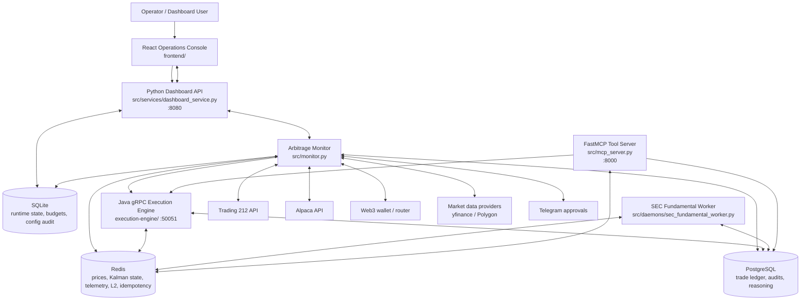

# Architecture

Alpha Arbitrage is a multi-service trading research stack. The Python backend owns strategy, orchestration, risk, dashboard APIs, and brokerage dispatch. The Java execution engine provides a gRPC execution/audit sidecar for low-latency dry-run execution. The React frontend is the operator console.

## System Diagram

## Components

### Python Backend

The Python backend is the control plane and strategy runtime.

- `src/monitor.py` runs the scan loop, initializes pairs, computes signals, requests approvals, and submits paper/live executions.
- `src/services/dashboard_service.py` starts the operator API on port `8080`, serves the SPA when available, streams SSE telemetry, handles WebSocket telemetry, and exposes authenticated config/pair/trade/health routes.
- `src/mcp_server.py` is a separate optional FastMCP SSE server on port `8000` for assistant/tool workflows.
- `src/services/brokerage_service.py` routes non-crypto tickers to the configured equity broker (`BROKERAGE_PROVIDER=T212|ALPACA`) and crypto tickers to Web3 when not in paper mode.
- `src/services/pair_eligibility_service.py` rejects unsupported or high-friction pairs before Kalman state is allocated.

### Java Execution Engine

The Java service exposes `ExecutionService` over gRPC:

- `ExecuteTrade`
- `GetTradeStatus`
- `TriggerKillSwitch`

It wires `ExecutionServiceImpl`, `TradeLedgerRepository`, `RedisOrderSync`, `RedisL2FeedService`, and a broker router at startup. It uses Java 21 virtual threads. Today it must run in `DRY_RUN=true`; live Java brokerage is intentionally blocked until a production broker implementation exists.

### Frontend

The React console provides:

- login/session flow
- overview and runtime telemetry
- pair universe editing and hot reload
- trade history and open positions
- bot start/stop/restart requests
- config editing with 2FA for sensitive values
- CPU, memory, network, and log/event views

### Persistence

| Store | Role |
|---|---|
| Redis | Fast state: Kalman filters, latest prices, L2 books, telemetry, fundamental-score cache, Java idempotency helpers |
| PostgreSQL | Durable trading/audit data: ledger, fills, reasoning, journal, market regime |
| SQLite | Local runtime state: budgets, system state, dashboard 2FA/config audit, fallback history |
| `data/pairs.json` | Dashboard-edited pair universe override |
| `data/bot_settings.json` | Dashboard-edited setting override |

## Signal Flow

1. Candidate pairs are loaded from `settings.ARBITRAGE_PAIRS` plus `settings.CRYPTO_TEST_PAIRS`, or crypto-only in `DEV_MODE`.
2. Pair eligibility rejects mixed crypto/equity, cross-session, cross-currency, high-cost, and short-hold LSE pairs according to config.
3. Historical prices warm Kalman filters and run static plus optional rolling cointegration checks.
4. The monitor fetches latest prices and updates each Kalman filter.
5. The entry z-score threshold is checked. Optional cost scaling raises the threshold for high-friction pairs.
6. The orchestrator validates the signal through macro beacon checks, bull/bear agents, Redis SEC scores, whale watcher context, portfolio logic, and global accuracy scaling.
7. If confidence exceeds `MONITOR_MIN_AI_CONFIDENCE`, the operator approval path is triggered.
8. Paper mode calls `shadow_service.execute_simulated_trade()` with the original `signal_id`.
9. Live mode submits both legs through `BrokerageService`, using the active equity broker for non-crypto tickers and emergency-closing leg A if leg B fails. The Trading 212 path keeps its available-share preflight before live sell legs.
10. Trade ledger and journal rows are persisted for auditability.

## Security Model

- `POSTGRES_PASSWORD` and `DASHBOARD_TOKEN` are required and must be non-default.
- Broker credentials are only required for the configured live path: `T212_API_KEY`/`T212_API_SECRET` for Trading 212, or `ALPACA_API_KEY`/`ALPACA_API_SECRET`/`ALPACA_BASE_URL` for Alpaca.
- Dashboard API calls use `Authorization: Bearer <DASHBOARD_TOKEN>` plus `X-Dashboard-Session`.
- Login can be approved by Telegram notification; TOTP/backup codes protect sensitive config writes after setup.
- CORS origins are controlled by `DASHBOARD_ALLOWED_ORIGINS`; wildcard origins are only accepted in `DEV_MODE=true`.
- WebSocket telemetry requires either query/session auth or an initial auth message.
- Live approvals are blocked unless Telegram is configured, unless `ALLOW_LIVE_APPROVAL_WITHOUT_TELEGRAM=true`.

## Deployment Shape

The Docker stack is split into:

- `bot`: Python monitor and dashboard API
- `mcp-server`: optional FastMCP server command using the same Python image
- `sec-worker`: background SEC scoring worker
- `execution-engine`: Java gRPC sidecar
- `frontend`: nginx static React app
- `redis`
- `postgres`

See `infra/README.md` for concrete Compose commands.
